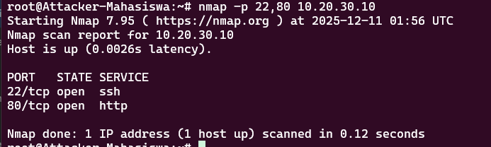

# Laporan Tugas Akhir - ITS Secure Network Challenge

**Mata Kuliah:** Keamanan Jaringan Komputer  
**Departemen:** Teknologi Informasi - ITS  
**Kelas:** C - Kelompok 1 <br>
**Judul:** Deteksi Serangan Menggunakan IDS Suricata/Snort

## Anggota Kelompok

| Nama | NRP |
| :--- | :--- |
| Syela Zeruya Tandi Lalong | 5027231076 |
| Tasya Aulia Darmawan | 5027241009 |
| Azaria Raissa Maulidinnisa | 5027241043 |
| M. Hikari Reiziq Rakhmadinta | 5027241079 |
| Ni'mah Fauziyyah Atok | 5027241103 |

---
## Latar Belakang

Departemen Teknologi Informasi ITS melaporkan adanya indikasi kebocoran data berskala kecil pada subnet Riset & IoT (10.20.30.0/24). Berdasarkan log firewall, terdeteksi adanya lonjakan lalu lintas mencurigakan yang berasal dari subnet Mahasiswa (10.20.10.0/24). Untuk itu, tim ditugaskan melakukan pemasangan IDS (Suricata/Snort dalam mode monitoring) guna mendeteksi pola serangan yang tidak dapat dideteksi oleh firewall. Berikut adalah beberapa kejanggalan yang ditemukan:

1.  **Scanning:** Pencarian port terbuka.
2.  **Brute Force:** Upaya paksa masuk ke server.
3.  **Exfiltration:** Pengambilan data rahasia.
   
## Desain Topologi Jaringan

Berikut adalah desain akhir infrastruktur jaringan yang telah kami implementasikan. Topologi ini dirancang menggunakan prinsip **Defense in Depth** (Pertahanan Berlapis) dan **Modularitas** untuk menjamin keamanan, ketersediaan, dan kemudahan pengembangan.


**Lokasi IDS:** Node Terpisah (Out-of-Band) yang terhubung ke interface `eth6` pada **Core Router**.
**Alasan Pemilihan (Traffic Mirroring):**
* **Visibilitas Sentral:** Core Router adalah titik temu antar-subnet (Mahasiswa ↔ Riset).
* **Kinerja:** Memisahkan IDS dari jalur utama (bukan inline) menjaga throughput jaringan tetap stabil.

### Komponen Utama Topologi:
1.  **Perimeter Security (Edge & Firewall):** Melindungi jaringan kampus dari ancaman eksternal dan menangani lalu lintas keluar-masuk internet (NAT).
2.  **Internal Security (Core Router ACL):** Menerapkan segmentasi jaringan yang ketat antar departemen (Mahasiswa, Admin, Riset, Guest) untuk mencegah pergerakan lateral serangan.
3.  **High Availability (Load Balancer):** Menggunakan Nginx Load Balancer pada subnet Riset untuk mendistribusikan beban lalu lintas ke Server Riset dan Server Smart City.
4.  **Dynamic Addressing:** Implementasi DHCP Server pada Core Router untuk manajemen IP otomatis pada subnet publik (Mahasiswa & Guest).

---

## Konfigurasi IDS

**1. Arsitektur Operasi & Interface**

| Parameter | Detail | Keterangan |
| :--- | :--- | :--- |
| Node Suricata | Node Terpisah (Out-of-Band) | Tidak menghalangi traffic utama |
| Interface Monitor | eth0 | Menerima mirroring paket dari Core Router |
| Operation Mode | Passive/Monitor Mode | Dijalankan dengan ```-i $INT``` |
| Optimasi Kinerja | ```ethtool -K \$INT rx off ...``` | Optimasi kernel pada NIC untuk mengurangi beban CPU (offloading checksums, dll.) |

**2. Variabel Jaringan Utama**

| Variabel Jaringan | Value | Keterangan |
| :--- | :--- | :--- |
| HOME_NET | [10.0.0.0/8, 192.168.0.0/16] | Mencakup seluruh jaringan internal ITS (termasuk Riset 10.20.30.0/24 dan Akademik 10.20.20.0/24). |
| EXTERNAL_NET | !$HOME_NET | Semua, kecuali HOME_NET|
| Packet Acquisition | af-packet | Untuk efisiensi tinggi dalam membaca packet yang di mirror |

## Custom Rules
### Files: 
```tugas.rules```

1. Deteksi Port Scanning (SID: 1001) (Reconnaissance)

```
alert tcp 10.20.10.0/24 any -> 10.20.30.0/24 any (msg:"[BAHAYA] Port Scanning Terdeteksi (SYN Scan)"; flags:S; threshold: type both, track by_src, count 5, seconds 10; classtype:attempted-recon; sid:1001; rev:7;)
```
  
Rule ini mendeteksi jika IP dari subnet Mahasiswa (10.20.10.0/24) mengirimkan 5 paket SYN (inisiasi koneksi) dalam waktu 10 detik menuju subnet Riset, mengindikasikan upaya pemindaian cepat.
    
2. Deteksi Brute Force SSH (SID: 1002)
    
```
alert tcp any any -> 10.20.30.10 22 (msg:"[KRITIS] Percobaan Brute Force SSH (3x Percobaan)"; flags:S; threshold: type both, track by_src, count 3, seconds 30; classtype:attempted-admin; sid:1002; rev:7;)
```
    
Rule ini memicu peringatan jika terdeteksi lebih dari 3 percobaan koneksi SSH (melalui flag SYN) dari sumber manapun menuju IP Server Riset (10.20.30.10) dalam waktu 30 detik.
    
3. Deteksi Data Exfiltration (SID: 1003) (Pencurian Data)
    
```
alert ip 10.20.30.10 any -> 10.20.10.0/24 any (msg:"[ALERT] Indikasi Pencurian Data via HTTP (Exfiltration)"; content:"HTTP"; flow:from_server,established; threshold: type limit, track by_src, count 1, seconds 60; classtype:policy-violation; sid:1003; rev:7;)
```
    
Rule ini mendeteksi aktivitas transfer file yang keluar (flow:from_server,established) dari Server Riset (10.20.30.10) menuju Subnet Mahasiswa (10.20.10.0/24) yang menggunakan protokol HTTP. Log dibatasi (anti-spam) menjadi 1x per menit.

4. Deteksi Ping Test (SID: 1004)

```
alert icmp any any -> any any (msg:"[INFO] Paket ICMP Ping Terdeteksi (Log Dibatasi)"; itype:8; threshold: type limit, track by_src, count 1, seconds 60; classtype:misc-activity; sid:1004; rev:7;)
```

Rule ini mendeteksi paket ICMP Echo Request (itype:8) dan mencatatnya sebagai informasi. Log dibatasi (anti-spam) menjadi 1x per menit.

---
## Simulasi Serangan

### 1. Port Scanning (Nmap)

Command:
```
nmap -p 22,80 10.20.30.10
```


Log Alert IDS:


#### KESIMPULAN:
IDS Suricata berhasil mendeteksi aktivitas port scanning dari subnet Mahasiswa (10.20.10.0/24) menuju Server Riset (10.20.30.10) melalui **Rule SID 1001**. Serangan ini teridentifikasi karena Nmap mengirimkan lebih dari 5 paket SYN dalam waktu kurang dari 10 detik, memenuhi threshold yang telah dikonfigurasi. Alert yang muncul mengkonfirmasi bahwa penyerang sedang melakukan reconnaissance untuk mencari port terbuka (22 dan 80) sebagai tahap awal serangan. Deteksi ini sangat penting karena port scanning sering menjadi indikator awal dari serangan yang lebih kompleks seperti exploitation atau brute force.

### 2. SSH Brute Force

Command:

```
for i in {1..5}; do ssh -o ConnectTimeout=2 -o BatchMode=yes targetuser@10.20.30.10 "exit"; done
```


Output Log IDS Brute Force:


#### KESIMPULAN:
IDS berhasil mendeteksi percobaan brute force SSH terhadap Server Riset (10.20.30.10) melalui **Rule SID 1002**. Meskipun hanya dilakukan 5 kali percobaan login dalam simulasi ini, IDS sudah memicu alert setelah 3 percobaan koneksi SSH dalam waktu 30 detik. Ini menunjukkan bahwa sistem mampu mendeteksi pola serangan brute force secara dini sebelum penyerang berhasil menemukan kredensial yang valid. Alert ini mengklasifikasikan serangan sebagai **attempted-admin**, yang mengindikasikan upaya akses tidak sah ke sistem administratif. Deteksi cepat seperti ini memungkinkan administrator untuk segera mengambil tindakan preventif seperti memblokir IP penyerang atau menerapkan rate limiting pada layanan SSH.

### 3. Data Exflitration (HTTP Wget)
Command: 
```
wget http://10.20.30.10/index.html
```


Output Log IDS Data Exfiltration:


#### KESIMPULAN:
IDS berhasil mendeteksi aktivitas data exfiltration menggunakan **Rule SID 1003**. Dalam simulasi ini, command `wget` dijalankan dari subnet Mahasiswa (10.20.10.0/24) untuk mengunduh file `index.html` dari Server Riset (10.20.30.10). Meskipun **request** berasal dari Mahasiswa, yang terdeteksi oleh IDS adalah **response HTTP dari Server Riset** yang mengirimkan data kembali ke Mahasiswa (flow:from_server,established). Inilah yang dikategorikan sebagai **data exfiltration**, yaitu data yang keluar dari server menuju subnet yang tidak seharusnya mengaksesnya. Rule ini efektif mendeteksi transfer data mencurigakan karena memantau arah traffic dari server (bukan ke server). Namun, perlu dicatat bahwa rule ini hanya efektif untuk protokol HTTP (plaintext) dan tidak dapat mendeteksi exfiltration melalui HTTPS tanpa SSL inspection. Dalam skenario nyata, ini bisa mengindikasikan pencurian data sensitif seperti file konfigurasi, database, atau dokumen rahasia dari server.

---
## Hasil Analisis Singkat

Serangan **Port Scanning** adalah yang paling mudah dan cepat memicu alert karena Nmap mengirimkan paket SYN dalam jumlah masif dalam waktu sangat singkat, sehingga langsung memicu ambang batas (threshold) pada rule IDS tanpa ambiguitas. Dalam simulasi, hanya dengan scanning 2 port (22 dan 80), IDS langsung mendeteksi pola serangan karena jumlah paket SYN yang dikirim melebihi threshold 5 paket dalam 10 detik. Berbeda dengan SSH Brute Force yang memerlukan beberapa percobaan login, atau Data Exfiltration yang bergantung pada analisis konten paket, Port Scanning memiliki signature yang sangat jelas dan mudah diidentifikasi.

Dalam simulasi ini, **false positive ditekan seminimal mungkin** dengan mendefinisikan `$HOME_NET` dan `$EXTERNAL_NET` secara spesifik, serta menggunakan threshold yang tepat untuk setiap jenis serangan. Namun, **rule Data Exfiltration (SID 1003)** berpotensi menghasilkan false positive jika subnet Mahasiswa memang diizinkan mengakses halaman web publik di Server Riset untuk keperluan akademik yang sah, karena setiap response HTTP dari server akan dianggap sebagai indikasi pencurian data. Solusi untuk meminimalkan false positive antara lain dengan menyesuaikan rule content untuk hanya mendeteksi file-file sensitif tertentu (misal: `.conf`, `.sql`, `.pdf` rahasia), menggunakan whitelist untuk IP yang sah, atau menambahkan korelasi dengan log autentikasi.

Beberapa aspek yang perlu ditingkatkan untuk memperkuat sistem deteksi dan pencegahan meliputi: (1) **SSL/TLS Inspection** - saat ini deteksi exfiltration hanya bekerja pada HTTP plaintext, sehingga diperlukan SSL decryption untuk mendeteksi traffic HTTPS; (2) **Mode IPS** - mengubah dari IDS (Deteksi) menjadi IPS (Pencegahan) agar sistem dapat memblokir IP penyerang secara otomatis setelah alert muncul; (3) **SIEM Integration** - mengintegrasikan log dari IDS, Firewall, dan Core Router ke dalam sistem SIEM seperti ELK Stack untuk korelasi event dan analisis forensik yang lebih komprehensif; serta (4) **Threat Intelligence Feed** untuk mendeteksi IP atau domain berbahaya yang sudah dikenal secara global.

---
## Kesimpulan

Implementasi IDS Suricata pada infrastruktur jaringan ITS berhasil mendeteksi ketiga jenis serangan yang disimulasikan: Port Scanning, SSH Brute Force, dan Data Exfiltration. Custom rules yang telah dikonfigurasi (SID 1001, 1002, dan 1003) terbukti efektif dalam mengidentifikasi pola serangan dengan threshold yang tepat, sehingga mampu memberikan alert secara real-time tanpa mengganggu performa jaringan. Port Scanning menjadi serangan yang paling mudah dan cepat terdeteksi karena signature-nya yang jelas, sementara Data Exfiltration memerlukan analisis konten paket yang lebih mendalam. Meskipun false positive masih berpotensi terjadi terutama pada rule exfiltration, hal ini dapat diminimalkan dengan penyesuaian rule yang lebih spesifik dan implementasi whitelist. Untuk meningkatkan efektivitas sistem keamanan, diperlukan pengembangan lebih lanjut seperti SSL/TLS Inspection untuk mendeteksi traffic terenkripsi, upgrade ke mode IPS untuk pencegahan otomatis, serta integrasi dengan SIEM untuk monitoring dan analisis yang lebih komprehensif. Dengan demikian, sistem IDS ini telah membuktikan kemampuannya sebagai lapisan pertahanan tambahan yang penting dalam arsitektur Defense in Depth jaringan kampus ITS.
